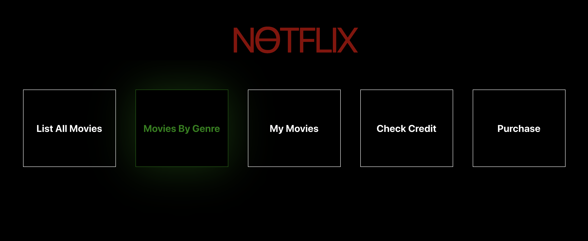
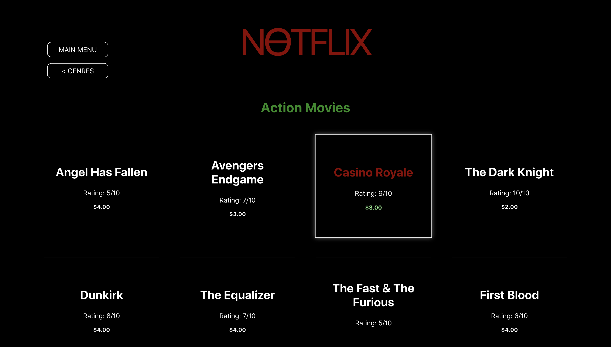
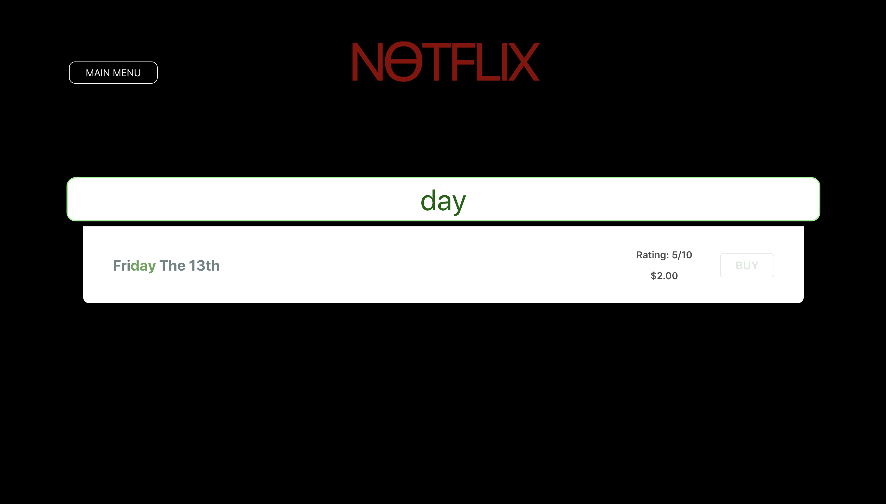

# NƟTFLIX - HackerX Code Challenge

## Browse through a library of movies and purchase them to watch at home!

&nbsp;&nbsp;&nbsp;&nbsp;
&nbsp;&nbsp;&nbsp;&nbsp;
&nbsp;&nbsp;&nbsp;&nbsp;

## Getting Started

#### Terminal 1:
- `cd server` to access the backend API.
- `npm i` to install all dependencies.
- `npm start` to start the backend server.

#### Terminal 2:
- `cd client` to access the React application.
- `npm i` to install all dependencies.
- `npm start` to start the app.
- open `http://localhost:3000/` in your browser to start using the app.